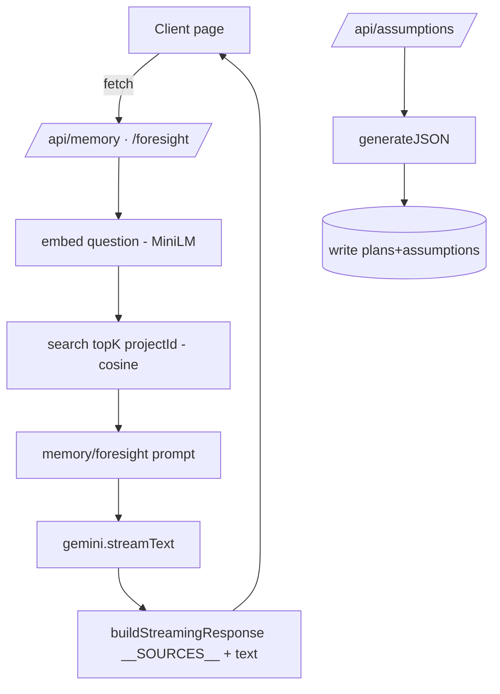
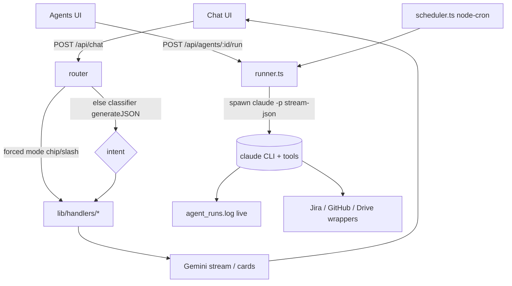

# Architecture — current shell and v2 target

## Current app shell

`app/layout.tsx` wraps the tree in providers and a login gate:

```
SessionProvider
  └─ SourcesProvider
       └─ LoginGate  (3-step auth: Team → Member → Project)
            └─ [ Sidebar | TopBar | main ]
```

`LoginGate` gates the app until a session exists, then renders the shell.
Clients read the active `{team, member, project}` via `useSession()`. The
**Sidebar** is a hardcoded `NAV` array of 8 entries: Memory `/`, Assumptions,
Foresight, Interviewer, Capture, Decisions, Activity, Settings.

### ASCII component diagram (current)

```
                         ┌──────────────── Browser (React) ────────────────┐
                         │  SessionProvider → SourcesProvider → LoginGate    │
                         │     ┌─────────┐ ┌────────┐ ┌──────────────────┐   │
                         │     │ Sidebar │ │ TopBar │ │ main (page.tsx)  │   │
                         │     └─────────┘ └────────┘ └────────┬─────────┘   │
                         └──────────────────────────────────────┼───────────┘
                                                        fetch()  │
                    ┌───────────────────────────────────────────▼───────────┐
                    │  Next.js route handlers  (nodejs, force-dynamic)        │
                    │  /api/memory /assumptions /foresight /decisions         │
                    │  /api/capture /interviews …                             │
                    └───┬──────────┬──────────┬──────────┬───────────────────┘
                        ▼          ▼          ▼          ▼
                    lib/db   lib/embeddings lib/gemini  lib/retrieval
                   (SQLite)   (MiniLM local) (Gemini)   (cosine search)
                        └── lib/stream · lib/prompts · lib/jira · lib/activity
```

### Shared libs (`lib/`)

- **gemini.ts** — `model` (`GEMINI_MODEL`, default `gemini-3.1-flash-lite`),
  `streamText(prompt, sys?)` → async gen, `generateJSON(prompt, sys?)`
  (`responseMimeType: application/json`), `friendlyGeminiError()`.
- **retrieval.ts** — `search(query, topK=8, projectId?)`, `searchWithVector`,
  `cosineSimilarity`, `formatChunks` (`[source_id] (title — author, ts)\ncontent`).
- **embeddings.ts** — local `Xenova/all-MiniLM-L6-v2`, `embed(text)` → 384-dim
  L2-normalized, `warmEmbeddings()`.
- **stream.ts** — `buildStreamingResponse(prompt, sources)` → `text/plain`
  stream prefixed with `__SOURCES__<json>\n`.
- **prompts.ts** — extraction, memory, assumptions, foresight, interviewQuestions,
  interviewSynthesis.
- **db.ts** — `better-sqlite3` at `data/tacit.db` (WAL); idempotent migrations via
  `applyMigrations()` + `ensureColumn(table, col, type)` guarded by a module flag.
- **session.ts** — cookie `tacit_session {teamId,memberId,projectId}`.
- **activity.ts**, **ingest.ts**, **jira.ts** (READ-ONLY). See
  [02-data-model.md](./02-data-model.md) and [05-integrations/jira.md](./05-integrations/jira.md).

`next.config.ts` declares `serverExternalPackages: ["better-sqlite3","@xenova/transformers"]`.

### Current request flow (Mermaid)



## v2 target

Nav collapses to **Chat** (default) and **Agents**; Activity + Settings move to
the TopBar menu. A unified `POST /api/chat` classifies and dispatches to shared
handlers refactored out of the existing routes into `lib/handlers/*.ts`
(`runMemory`, `runAssumptions`, `runForesight`, `runDecisions`, `runCapture`,
`runInterviewTurn`). Agents run via `lib/agents/runner.ts` (spawns `claude -p`)
and `lib/agents/scheduler.ts` (node-cron singleton).

### v2 request flow (Mermaid)



See [03-chat-router.md](./03-chat-router.md) and
[04-agents/01-runtime-claude-p.md](./04-agents/01-runtime-claude-p.md).
