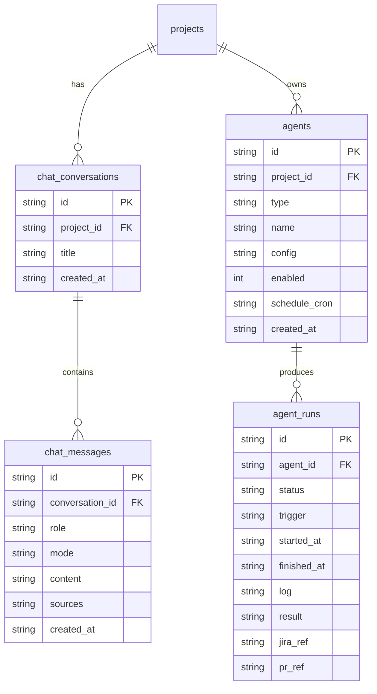

# Data model

All tables live in `data/tacit.db` (`better-sqlite3`, WAL). The schema is created
with `CREATE TABLE IF NOT EXISTS` and evolved by **idempotent migrations** in
`lib/db.ts`: `applyMigrations()` runs once (guarded by a module flag), and
`ensureColumn(table, col, type)` adds any missing column. This means an existing
DB picks up new columns without a reset — the same pattern the v2 tables use.

## Current tables

- **documents** — the memory store.
  `id, source, source_id, author, ts, title, content, embedding (JSON 384 floats),
  project_id, member_id, linked_jira_key, linked_jira_url`.
  `source` ∈ `jira | slack | incident | interview | upload`.
- **decisions** — `id, title, decision, reasoning, alternatives (JSON),
  people (JSON), outcome, ts, source_ids (JSON), project_id`.
- **plans** — `id, title, content, created_at`.
- **assumptions** — `id, plan_id, text, why_load_bearing, risk,
  stated_or_implicit, validated`.
- **interviews** — `id, trigger_type, trigger_ref, person, questions (JSON),
  answers (JSON), status (pending|answered|synthesized), answered_by, project_id,
  created_at`.
- **teams** — `id, name, created_at`.
- **members** — `id, team_id, name, email, role, created_at`.
- **projects** — `id, team_id, name, owner_member_id, jira_project_key,
  jira_base_url, jira_email, jira_token, created_at`.
- **activities** — `id, team_id, project_id, member_id, type, title, detail, ref,
  created_at`. `type` ∈ `memory | assumptions | foresight | interview |
  jira_import | capture`.
- **comments** — `id, activity_id, member_id, body, created_at`.
- **activity_tags** — `id, activity_id, member_id, created_at` (unique per pair).

## New in v2

Added via the same `ensureColumn` / `CREATE TABLE IF NOT EXISTS` pattern — no
migration reset.

**Chat** (project-scoped, see [03-chat-router.md](./03-chat-router.md)):
- **chat_conversations** — `id, project_id, title, created_at`.
- **chat_messages** — `id, conversation_id, role (user|assistant), mode,
  content, sources (JSON), created_at`.

**Agents** (see [04-agents/00-overview.md](./04-agents/00-overview.md)):
- **agents** — `id, project_id, type, name, config (JSON), enabled,
  schedule_cron, created_at`.
- **agent_runs** — `id, agent_id, status, trigger, started_at, finished_at, log,
  result (JSON), jira_ref, pr_ref`. `status` ∈ `queued|running|done|failed`.

### erDiagram of the additions

`agent_runs.log` is appended to live as the runner parses `claude -p`
stream-json events; `result` holds the structured verdict. See
[04-agents/01-runtime-claude-p.md](./04-agents/01-runtime-claude-p.md).
