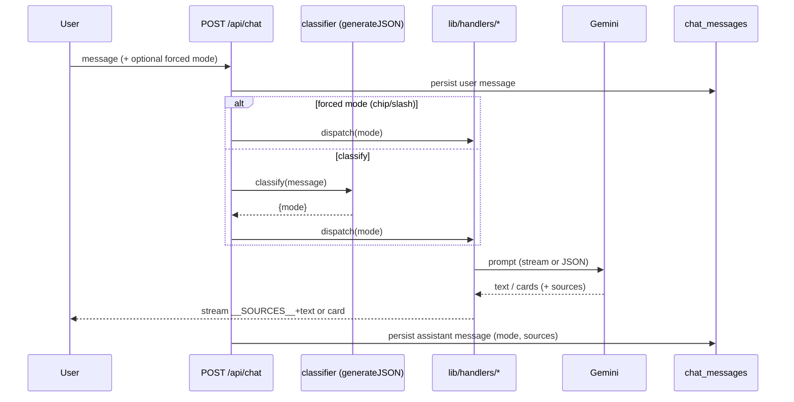

# Unified Chat & router

v2 replaces the eight surfaces with a single Chat thread backed by
`POST /api/chat`. Chat stays on **Gemini**, so it requires a quota'd Gemini API
key to function — see the limitation note below.

## Intent set

The router maps each message to one of:

`memory · assumptions · foresight · decisions · capture · interview · smalltalk`

## Hybrid routing

1. **Forced mode** — if the user picks a chip or types a **slash-command**
   (`/memory`, `/foresight`, `/assumptions`, `/decisions`, `/capture`,
   `/interview`), that `mode` is used directly, skipping classification.
2. **Classifier** — otherwise a cheap `generateJSON` call classifies the message
   into the intent set (returns `{mode}`). `smalltalk` short-circuits to a plain
   Gemini reply.

## Dispatch to shared handlers

The classified `mode` dispatches to handlers refactored **out of the existing
routes** into `lib/handlers/*.ts` so Chat and any legacy endpoint share one
implementation:

| mode        | handler            | rendering                         |
|-------------|--------------------|-----------------------------------|
| memory      | `runMemory`        | streamed text + `__SOURCES__`     |
| foresight   | `runForesight`     | streamed text + `__SOURCES__`     |
| assumptions | `runAssumptions`   | inline card(s)                    |
| decisions   | `runDecisions`     | inline card(s)                    |
| capture     | `runCapture`       | confirmation card                 |
| interview   | `runInterviewTurn` | Q&A bubbles                       |

Memory and Foresight keep the **`__SOURCES__` streaming contract**
(`__SOURCES__<json>\n` then text) so citation chips render as they do today.
Assumptions and Decisions render as **inline cards** in the message list. A
shared **Bubble / message-list** component (extracted from the Interviewer page's
Bubble) renders all message types.

## Persistence

Conversations and turns persist to `chat_conversations` and `chat_messages`
(project-scoped), added via the `ensureColumn` pattern — see
[02-data-model.md](./02-data-model.md). Each assistant message stores its `mode`
and any `sources` JSON so the thread reloads with chips intact.

## Sequence of a routed message

## Limitation

Because Chat runs on Gemini, an **exhausted or missing Gemini key disables Chat**
entirely (unlike Agents, which use the local `claude -p` login — see
[04-agents/00-overview.md](./04-agents/00-overview.md)). `friendlyGeminiError`
surfaces quota/auth failures as a single readable line.
