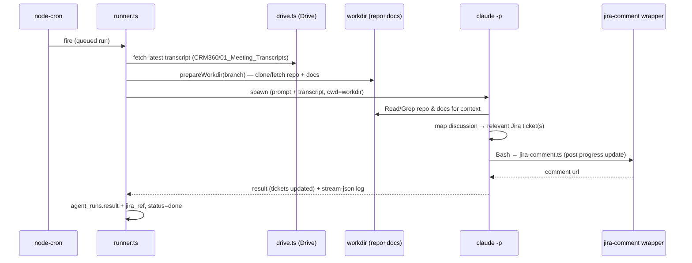

# Daily Scrum Agent

**Type:** scheduled (node-cron, daily). **Goal:** turn the day's standup
transcript into a concrete progress update on the right Jira ticket(s).

## PRD

- **Trigger:** a daily cron on the agent's `schedule_cron` (see
  [02-scheduling.md](./02-scheduling.md)).
- **Inputs:** the latest standup transcript from the Google Drive folder
  `CRM360/01_Meeting_Transcripts` ([../05-integrations/google-drive.md](../05-integrations/google-drive.md));
  the repo branch + `docs/` in the prepared workdir.
- **Behavior:** read the transcript, understand what was discussed and by whom,
  read the repo/docs for context, **map the discussion to the relevant Jira
  ticket(s)**, then post a progress comment/update on each.
- **Outputs:** a Jira comment per ticket
  ([../05-integrations/jira.md](../05-integrations/jira.md)) and an
  `agent_runs.result` summary with `jira_ref`(s).
- **Non-goals:** it does not close tickets or transition status by default
  (transition is available but off unless configured).

## Flow

See the end-to-end version in [../07-flows.md](../07-flows.md) and the demo Drive
corpus in [../08-demo-data.md](../08-demo-data.md).
