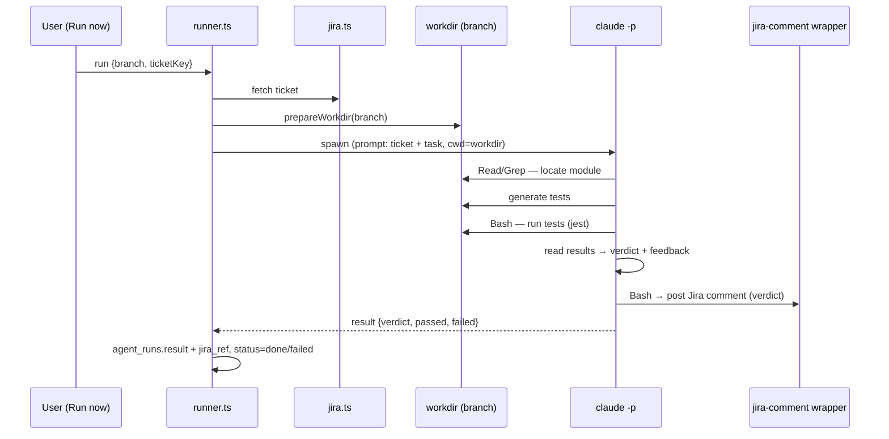

# Tester Ticket Agent

**Type:** on-demand. **Goal:** given a branch and a Jira ticket, generate and run
tests for the ticket's module and report a pass/fail verdict with feedback. This
is the **first agent built** (see [../09-roadmap-phases.md](../09-roadmap-phases.md))
because it can run for real once a coded CRM360 module exists.

## PRD

- **Trigger:** on-demand via **Run now** / `POST /api/agents/[id]/run`, with
  inputs `{ branch, ticketKey }`.
- **Inputs:** the Jira ticket (read via the connector) and the repo branch
  checked out into the workdir.
- **Steps:**
  1. Read the ticket (acceptance criteria, description).
  2. Check out the branch into the workdir (`prepareWorkdir(branch)`).
  3. Locate the relevant module (Read/Grep/Glob).
  4. **Generate** tests for it and **run** them (Bash — e.g. `jest`).
  5. Read the results and produce a **pass/fail verdict + feedback**.
- **Outputs:** a Jira comment with the verdict
  ([../05-integrations/jira.md](../05-integrations/jira.md)) and
  `agent_runs.result` (`{verdict, passed, failed, notes}`, `jira_ref`).
- **Tools:** `Read, Grep, Glob, Bash` (Bash to run tests + the `jira-comment`
  wrapper). See [01-runtime-claude-p.md](./01-runtime-claude-p.md).

## Flow

The planted-vuln CRM360 module + Jest tests that make this run end-to-end are
described in [../08-demo-data.md](../08-demo-data.md).
