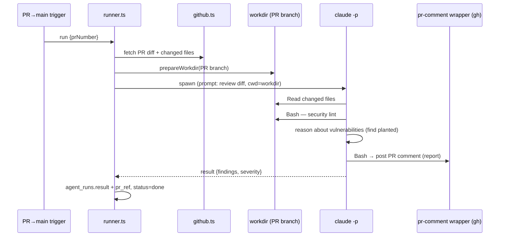

# PR Security Agent

**Type:** event-triggered. **Goal:** when a pull request targets `main`, review
the diff for security vulnerabilities and post a security report as a PR comment.

## PRD

- **Trigger:** a PR targeting `main` (invoked ad-hoc via
  `POST /api/agents/[id]/run` with `{ prNumber }`, or wired to a PR webhook — see
  [02-scheduling.md](./02-scheduling.md)).
- **Inputs:** the PR diff and changed files
  ([../05-integrations/github.md](../05-integrations/github.md)).
- **Steps:**
  1. Fetch the PR diff / changed files.
  2. Read the changed files in the workdir.
  3. Run a **security lint** and **reason** about vulnerabilities (SQL/command
     injection, secrets, authz gaps, unsafe deserialization, etc.) — including
     finding **planted** vulnerabilities in the demo.
  4. Produce a structured security report.
- **Outputs:** a **PR comment** with the report
  ([../05-integrations/github.md](../05-integrations/github.md)) plus
  `agent_runs.result` (`{findings[], severity}`, `pr_ref`).
- **Tools:** `Read, Grep, Glob, Bash` (Bash runs the linter + the `gh` CLI /
  `pr-comment` wrapper). See [01-runtime-claude-p.md](./01-runtime-claude-p.md).

## Flow

The demo repo `Alin-Verma/CRM360` and its planted-vuln PR are described in
[../08-demo-data.md](../08-demo-data.md).
