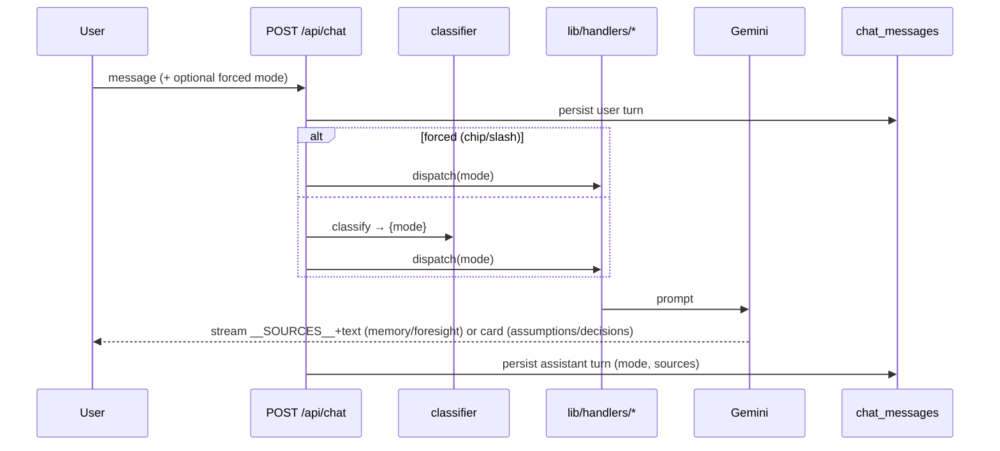
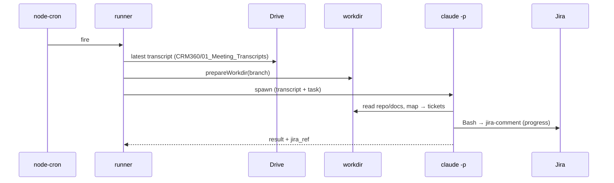
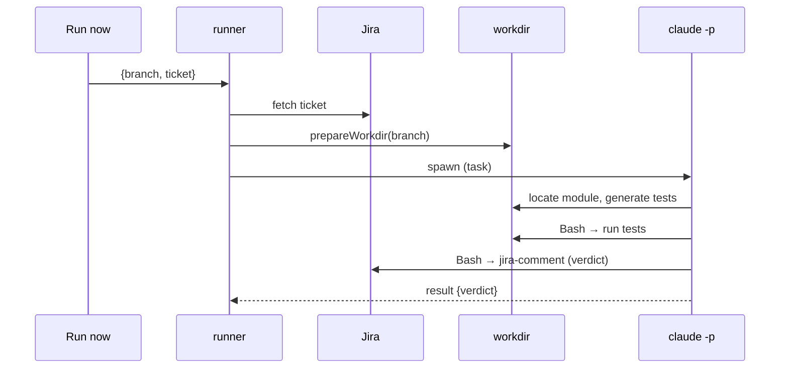
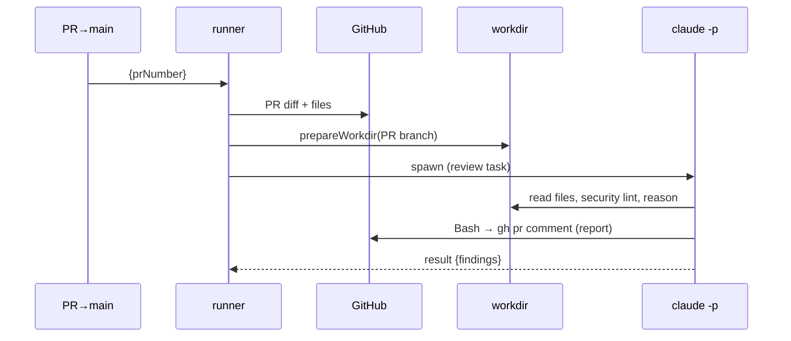

# End-to-end flows

Cross-references: [03-chat-router.md](./03-chat-router.md),
[04-agents/](./04-agents/00-overview.md).

## A chat turn

## Daily Scrum run

## Tester run

## PR Security run

See per-agent detail: [Daily Scrum](./04-agents/03-agent-daily-scrum.md) ·
[Tester](./04-agents/04-agent-tester.md) ·
[PR Security](./04-agents/05-agent-pr-security.md).
